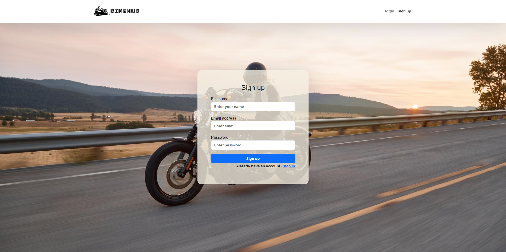

# Motorcycle Booking Frontend

> The app is the front end version of the Motorcycle booking services. Built with react exclusively. The app fetches data from the api. The app allows you to see tha details of the Motorcylce. You can reserve the best motorcycle of your choice and have a test driving.

## Link to the backend
[Motorcycle Booking Backend](https://github.com/vikipretium/motorcycle-testdrive-backend)

## Kanban Board
[Kanban Board](https://github.com/users/vikipretium/projects/1/views/1)

> ***We are a group of four***
1. Team 1 - [Roshan](https://github.com/roshan-bajgain)
2. Team 2 - [Vignesh](https://github.com/vikipretium)
3. Team 3 - [Alick](https://github.com/Beardless-sheik)
4. Team 4 - [David](https://github.com/daudi13)

## Preview:

### Multi device Compatibility


### Home Page


### Details Page


### Booking Page


### Booking list page


### Sign Up Page



### Sign In Page


## Built With

- HTML
- CSS
- Tailwind
- JavaScript
- REACT
- Redux
- Webpack

## Live version

[Motorcycle-Booking](https://bikehub.vercel.app/)

## Getting Started

To get a local copy up and running follow these simple example steps.

### Prerequisites
- A text editor(preferably Visual Studio Code)
- Node
- Web browser

### Using it Locally

- Clone the project

```bash 
git clone git@github.com:vikipretium/motorcycle-testdrive-frontend.git
cd motorcycle-testdrive

```

- Install dependencies

```bash
npm i 
or
npm install
```
- To Start the development server
```bash
npm start
```

## Visit And Open Files

[Visit Repo](https://github.com/vikipretium/motorcycle-testdrive-frontend)


## Authors

👤 **Vignesh**

- GitHub: [@vikipretium](https://github.com/vikipretium)
- Twitter: [@vikipretium](https://twitter.com/vikipretium)
- LinkedIn: [vikipretium](https://linkedin.com/in/vikipretium)

👤 **David**

- GitHub: [@daudi13](https://github.com/@daudi13)
- Twitter: [@davouma](https://twitter.com/davouma)
- LinkedIn: [LinkedIn](https://linkedin.com/in/linkedinhandle)

👤 **Alick Nyirenda**

- GitHub: [@AlickNyirenda](https://github.com/Beardless-sheik)
- Twitter: [@beardless_sheik](https://twitter.com/Beardless_Sheik)
- LinkedIn: [Alick Nyirenda](https://www.linkedin.com/in/alick-nyirenda/)

👤 **Roshan Bajgain**

- GitHub: [@roshan-bajgain](https://github.com/roshan-bajgain)
- Twitter: [@RoshanBajgain10](https://twitter.com/RoshanBajgain10)
- LinkedIn: [LinkedIn](https://www.linkedin.com/in/roshan-bazgain/)


## 🤝 Contributing

Contributions, issues, and feature requests are welcome!

Feel free to check the [issues page](https://github.com/vikipretium/motorcycle-testdrive-frontend/issues).

## Show your support

Give a ⭐️ if you like this project!

## Acknowledgments

- Inspired by original design for Creative Commons by [Murat Korkmaz](https://www.behance.net/muratk) on [Behance](https://www.behance.net/gallery/26425031/Vespa-Responsive-Redesign).
- Inspiration: Microverse

## 📝 License

This project is [MIT](./LICENSE.md) licensed.
